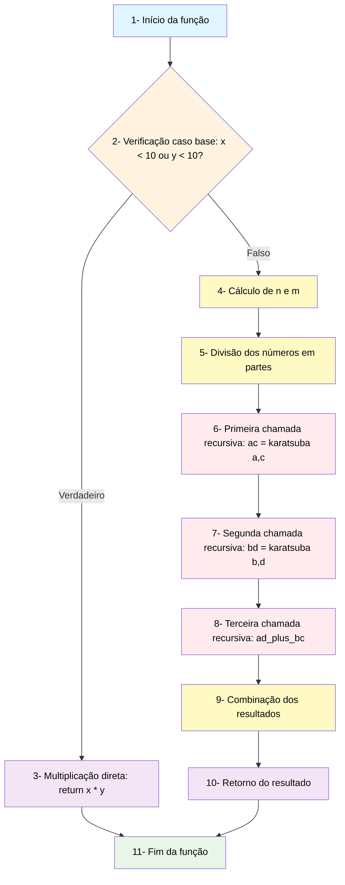

# Algoritmo de Karatsuba - Multiplicação Eficiente

O **Karatsuba Algorithm** é um projeto que implementa o algoritmo de Karatsuba para multiplicação eficiente de números inteiros grandes. Este algoritmo, desenvolvido por Anatoly Karatsuba em 1960, revolucionou a área de multiplicação de números grandes ao reduzir a complexidade de O(n²) para O(n^log₂3) ≈ O(n^1.585).

## Algoritmo de Karatsuba

O **Algoritmo de Karatsuba** é um método de multiplicação rápida que utiliza a estratégia "dividir para conquistar". Em vez de realizar quatro multiplicações como no método tradicional de multiplicação escolar, o algoritmo de Karatsuba realiza apenas três multiplicações recursivas, resultando em uma melhoria significativa na complexidade assintótica.

### Princípio Fundamental

Para multiplicar dois números x e y, o algoritmo:

1. **Divide** os números em duas partes de tamanho aproximadamente igual
2. **Calcula** três produtos ao invés de quatro
3. **Combina** os resultados para obter o produto final

A fórmula matemática base é:
```
Se x = a·10^m + b e y = c·10^m + d, então:
x·y = ac·10^(2m) + [(a+b)(c+d) - ac - bd]·10^m + bd
```

## Descrição do Projeto

### Implementação Linha por Linha

#### Função Principal `karatsuba(x, y)`

```python
def karatsuba(x, y):
    if x < 10 or y < 10:
        return x * y
```
**Linhas 4-6:** Define o caso base da recursão. Para números menores que 10, utiliza multiplicação direta do Python, que é mais eficiente para valores pequenos. Note que a docstring foi removida para simplificar o código.

```python
    n = max(len(str(x)), len(str(y)))
    m = n // 2
```
**Linhas 8-9:** Determina o tamanho da divisão. Converte os números para string para contar dígitos e divide pela metade (divisão inteira).

```python
    power_of_10 = 10 ** m
    
    a = x // power_of_10
    b = x % power_of_10
    c = y // power_of_10
    d = y % power_of_10
```
**Linhas 11-16:** Realiza a divisão dos números:
- `power_of_10`: Potência de 10 usada para dividir
- `a, b`: Partes alta e baixa de x
- `c, d`: Partes alta e baixa de y

```python
    ac = karatsuba(a, c)
    bd = karatsuba(b, d)
    ad_plus_bc = karatsuba(a + b, c + d) - ac - bd
```
**Linhas 18-20:** As três multiplicações cruciais (chave do algoritmo de Karatsuba):
- `ac`: Produto das partes altas
- `bd`: Produto das partes baixas  
- `ad_plus_bc`: Truque matemático que calcula ad + bc sem multiplicações extras

```python
    result = ac * (10 ** (2 * m)) + ad_plus_bc * (10 ** m) + bd
    return result
```
**Linhas 22-24:** Reconstrói o resultado final usando a fórmula de Karatsuba e retorna o produto.

### Explicação dos Testes

#### Função `testar_algoritmos()`

Esta função executa uma bateria de testes automatizados para validar o algoritmo de Karatsuba.

**Casos de Teste:**
- **Teste 1-3**: Números pequenos (123×456, 1234×5678, 12345×67890) para verificar correção básica
- **Teste 4**: Números médios (123456789×987654321) para observar performance em números maiores
- **Teste 5**: Números muito grandes (30+ dígitos) para demonstrar a eficiência do Karatsuba

**Processo de Teste:**
1. **Execução do Karatsuba**: Cada caso de teste executa o algoritmo de Karatsuba
2. **Validação**: Verifica se o resultado está correto comparando com multiplicação direta (x*y)
3. **Medição de Performance**: Calcula tempo de execução usando `time.time()`
4. **Exibição dos Resultados**: Mostra resultado e tempo de execução para cada teste

**Saída do Programa:**
- Apresenta o resultado de cada multiplicação
- Mostra o tempo de execução do algoritmo de Karatsuba
- Confirma a correção dos resultados com símbolo ✓

#### Função `exemplo_interativo()`

Permite ao usuário testar o algoritmo com números próprios, oferecendo:
- **Interface amigável** com input/output claro
- **Validação de entrada** para números inteiros
- **Execução do algoritmo de Karatsuba** com números fornecidos pelo usuário
- **Medição de tempo** para mostrar a performance do algoritmo
- **Tratamento de erros** para entradas inválidas
- **Opção de saída** para finalizar o programa

## Como Executar o Projeto

### Pré-requisitos

- Python 3.6 ou superior
- Sistema operacional: Windows, macOS ou Linux

### Passo 1: Clonar o Repositório

```bash
git clone https://github.com/mateusfaissal/Karatsuba-Algorithm.git
cd Karatsuba-Algorithm
```

### Passo 2: Executar o Programa

```bash
python3 main.py
```

### Passo 3: Interagir com o Programa

O programa oferece duas funcionalidades:

1. **Testes Automáticos**: Executa casos de teste predefinidos mostrando a correção e performance do algoritmo
2. **Modo Interativo**: Permite testar com números próprios para verificar o funcionamento do algoritmo

## Relatório Técnico

### Análise da Complexidade Ciclomática

#### Representação do Fluxo de Controle

O algoritmo de Karatsuba possui o seguinte fluxo de controle:

```
Início → Verificação caso base → [Se x<10 ou y<10] → Multiplicação direta → Fim
                                ↓ [Senão]
                         Cálculo de n e m → Divisão dos números → 
                         Três chamadas recursivas → Combinação → Fim
```

#### Grafo de Fluxo

**Representação Visual do Grafo:**



**Detalhamento dos Nós:**

| Nó | Descrição | Tipo |
|:--:|-----------|------|
| 1 | Início da função | Entrada |
| 2 | Verificação do caso base | Decisão |
| 3 | Multiplicação direta | Processamento |
| 4 | Cálculo de n e m | Processamento |
| 5 | Divisão dos números | Processamento |
| 6 | Primeira chamada recursiva | Processamento |
| 7 | Segunda chamada recursiva | Processamento |
| 8 | Terceira chamada recursiva | Processamento |
| 9 | Combinação dos resultados | Processamento |
| 10 | Retorno do resultado | Processamento |
| 11 | Fim da função | Saída |

**Nós do Grafo:**
1. Início da função
2. Verificação do caso base (`if x < 10 or y < 10`)
3. Multiplicação direta (`return x * y`)
4. Cálculo de n e m
5. Divisão dos números (a, b, c, d)
6. Primeira chamada recursiva (`ac = karatsuba(a, c)`)
7. Segunda chamada recursiva (`bd = karatsuba(b, d)`)
8. Terceira chamada recursiva (`ad_plus_bc = karatsuba(a + b, c + d) - ac - bd`)
9. Combinação dos resultados
10. Retorno do resultado
11. Fim da função

**Arestas do Grafo:**
- (1→2): Entrada na função
- (2→3): Caso base verdadeiro
- (2→4): Caso base falso
- (3→11): Retorno direto
- (4→5): Sequencial
- (5→6): Sequencial
- (6→7): Sequencial
- (7→8): Sequencial
- (8→9): Sequencial
- (9→10): Sequencial
- (10→11): Retorno

#### Cálculo da Complexidade Ciclomática

Usando a fórmula **M = E - N + 2P**:

- **E (Arestas)**: 11
- **N (Nós)**: 11  
- **P (Componentes conexos)**: 1

**M = 11 - 11 + 2(1) = 2**

**Complexidade Ciclomática = 2**

Esta baixa complexidade ciclomática indica que o código é simples de entender e testar, com apenas um ponto de decisão principal.

### Análise da Complexidade Assintótica

#### Complexidade Temporal

**Recorrência do Algoritmo:**
```
T(n) = 3T(n/2) + O(n)
```

Onde:
- `3T(n/2)`: Três chamadas recursivas com entrada de tamanho n/2
- `O(n)`: Operações de divisão, soma e combinação

**Aplicando o Teorema Mestre:**
- a = 3 (número de subproblemas)
- b = 2 (fator de redução)
- f(n) = O(n) (custo fora da recursão)

Como a = 3 > b¹ = 2, temos:
**T(n) = O(n^log₂3) ≈ O(n^1.585)**

#### Análise por Casos

**Melhor Caso: O(n^1.585)**
- Ocorre quando os números têm tamanhos similares
- A divisão é sempre balanceada
- Profundidade da recursão: log₂n

**Caso Médio: O(n^1.585)**
- Comportamento típico para números aleatórios
- A complexidade se mantém estável

**Pior Caso: O(n^1.585)**
- Mesmo com divisões desbalanceadas
- A complexidade assintótica não muda
- O algoritmo é consistente

#### Complexidade Espacial

**Espaço na Pilha de Recursão:**
- Profundidade máxima: O(log n)
- Cada chamada usa O(n) espaço para armazenar variáveis

**Complexidade Espacial Total: O(n log n)**

#### Comparação com Multiplicação Tradicional

| Algoritmo | Complexidade Temporal | Complexidade Espacial |
|-----------|----------------------|----------------------|
| Tradicional | O(n²) | O(1) |
| Karatsuba | O(n^1.585) | O(n log n) |

#### Ponto de Vantagem

O algoritmo de Karatsuba se torna vantajoso para números com mais de algumas centenas de dígitos (dependendo da implementação e hardware). O algoritmo demonstra sua eficiência quando:
- O número de dígitos é suficientemente grande para compensar o overhead da recursão
- A diferença de complexidade entre O(n²) e O(n^1.585) se torna significativa
- Para aplicações que trabalham com aritmética de precisão arbitrária

## Estrutura do Projeto

```
Karatsuba-Algorithm/
├── main.py          # Implementação principal e testes
├── README.md        # Documentação completa
└── .git/           # Controle de versão Git
```

## Tecnologias Utilizadas

- **Python 3.6+**: Linguagem de programação
- **Git**: Controle de versão
- **GitHub**: Hospedagem do código

## Versão do Python

Este projeto foi desenvolvido e testado na versão **Python 3.8+**.

## Links Úteis

- [Artigo Original de Karatsuba](https://en.wikipedia.org/wiki/Karatsuba_algorithm)
- [Análise Matemática Detalhada](https://mathworld.wolfram.com/KaratsubaMultiplication.html)
## Autor

**Mateus Faissal**
- GitHub: [@mateusfaissal](https://github.com/mateusfaissal)
- Email: mateusfaissal@gmail.com
